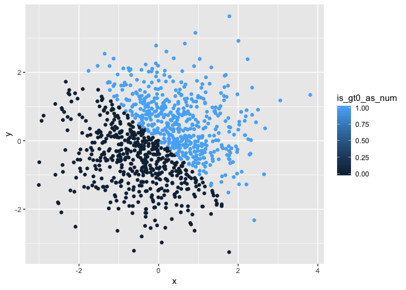
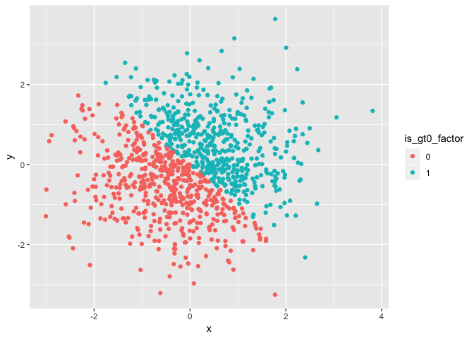

Homework 1 Code
================
Christian Pascual, cbp2128
2018-09-13

Preliminary preparation
=======================

``` r
library(tidyverse)
library(knitr)
set.seed(1)
```

We need to plot in this homework, so we need `ggplot` from `tidyverse`. For our tables, we'll use `kable()` from `knitr`. We are also generating random numbers, so we'll set a random seed.

Problem 1
=========

Problem 1 reviews R's data types and type coercion. We'd like to create a data frame with columns containing one of the various types in R. Thanks to vectorization, we can create other columns performing operations on the uniformly distributed numbers.

``` r
# Extract df length for change later
desired_col_length = 10
sentence = "Pretty sure that this sentence is 10 words long"

various_types_df = tibble(
  uniform_nums = runif(desired_col_length, min = 0, max = 5),
  is_gt_2 = uniform_nums > 2,
  characters = "P8105",
  factors = factor(is_gt_2, labels = c("NOT GT2", "GT2"))
)
```

results in:

|  uniform\_nums| is\_gt\_2 | characters | factors |
|--------------:|:----------|:-----------|:--------|
|      1.3275433| FALSE     | P8105      | NOT GT2 |
|      1.8606195| FALSE     | P8105      | NOT GT2 |
|      2.8642668| TRUE      | P8105      | GT2     |
|      4.5410389| TRUE      | P8105      | GT2     |
|      1.0084097| FALSE     | P8105      | NOT GT2 |
|      4.4919484| TRUE      | P8105      | GT2     |
|      4.7233763| TRUE      | P8105      | GT2     |
|      3.3039890| TRUE      | P8105      | GT2     |
|      3.1455702| TRUE      | P8105      | GT2     |
|      0.3089314| FALSE     | P8105      | NOT GT2 |

Type Coercion
-------------

Type coercion is the conversion of one type to another. There may be times where you try to perform an operation on a set of incompatible values. It makes sense to take the average of a set of numbers, but not of a collection of text.

Within our data, I would expect `mean()` to work on the uniform sample and the Boolean values since they are or can be coerced to numerical format. Programming languages will interpret `TRUE` as 1 and `FALSE` as 0, so taking the average of a set of booleans will be like averaging a collection of 1's and 0's.

Conversely, `mean()` will not work for the character vector or the factor vector they are not numerical in nature.

``` r
means_df = tibble(
  # Expected to work
  uniform_mean = mean(various_types_df$uniform_nums),
  logicals_mean = mean(various_types_df$is_gt_2),
  
  # Not expected to work
  char_mean = mean(various_types_df$characters),
  factor_mean = mean(various_types_df$factors)
)
```

results in:

|  uniform\_mean|  logicals\_mean|  char\_mean|  factor\_mean|
|--------------:|---------------:|-----------:|-------------:|
|       2.757569|             0.6|          NA|            NA|

`means_df` confirms our suspicions. `mean()` returns a meaningful result for the uniform numbers and the logical vector, but returns `NA` value for the characters and factors.

`means_df` has R do the type coercion implicitly, but sometimes it's better to be more explicit in your code. We will use the `as.numeric()` to try to tell R directly to do the coercion.

``` r
exp_coercion_df1 = tibble(
  coerced_logical = as.numeric(various_types_df$is_gt_2),
  coerced_character = as.numeric(various_types_df$characters),
  coerced_factor = as.numeric(various_types_df$factors)
)
```

Implicit to explicit coercion
-----------------------------

Explicit conversion allows us to convert the factor data into numbers whereas implicit coercion couldn't do this. This conversion makes sense if we think about the "numbering" to the factors. The factors are countable, so we can ascribe numbers to them.

R's vectorization capabilities allow us to just plug in coercion methods into each other. Thus, we can coerce even the character vector into a set of numbers, using factors as an intermediary.

``` r
exp_coercion_df2 = tibble(
  coerced_char2fac2num = as.numeric(
    as.factor(various_types_df$characters)
    ),
  coerced_fac2char2fac = as.numeric(
    as.character(various_types_df$factors)
    )
)
```

results in:

|  coerced\_char2fac2num|  coerced\_fac2char2fac|
|----------------------:|----------------------:|
|                      1|                     NA|
|                      1|                     NA|
|                      1|                     NA|
|                      1|                     NA|
|                      1|                     NA|
|                      1|                     NA|
|                      1|                     NA|
|                      1|                     NA|
|                      1|                     NA|
|                      1|                     NA|

Factor coercion allow us to connect characters to numbers. However, we cannot go from factor to character to number since the character to number conversion still doesn't make any sense to R.

Problem 2
=========

This problem will focus on inline code and plotting with R. We will create our own dataset below, using `rnorm()` to generate a sample of normally distributed random numbers for both `x` and `y`. Then, we will create other columns based on these random samples.

``` r
sample_size = 1000

data = tibble(
  x = rnorm(sample_size, mean = 0, sd = 1),
  y = rnorm(sample_size, mean = 0, sd = 1),
  is_gt0 = (x + y) > 0,
  is_gt0_as_num = as.numeric(is_gt0),
  is_gt0_factor = as.factor(is_gt0_as_num)
)
```

Data summarization
------------------

The dataframe is too large to display, but we can summarize it. The size of the dataset is 1000, the mean is -0.0106382, the median is -0.031318, and the proportion of `TRUE` in the logical vector is 0.49.

Data Visualizations
-------------------

Using `ggplot`, we can plot out the relationship between `x` and `y`. We'd like to differentiate between points where `x + y > 0`, so we can distinguish between them by specifying `is_gt0` in the `col` keyword argument in `aes()`. The result is a rough, pastel approximation of the Pepsi logo.

``` r
logical_plot = ggplot(data = data) +
  geom_point(mapping = aes(x = x, y = y, col = is_gt0))
```


The logical vector produces only two colors because there are only two options. We can use other columns to specify the coloring. Below, we use the numeric conversion of the boolean vector `is_gt0_as_num` to specify the coloring scheme. We get different colors, but the legend specifies different points.

``` r
ggplot(data = data) +
  geom_point(mapping = aes(x = x, y = y, col = is_gt0_as_num))
```



Since numbers are used to color, R also assumes that there might be some gradient, which shows up in the legend. We only have two values, but any value in between 0 and 1 would have shown up as a blend of blue and black.

Finally, we can plot out the coloring by the factors. There are only 2 factors, so the resulting plot will look like the first two plots.

``` r
ggplot(data = data) +
  geom_point(mapping = aes(x = x, y = y, col = is_gt0_factor))
```



All of the color scales can end up looking the same since we're only looking at binary sets of values (TRUE/FALSE, 0/1 for logical, 1/2 for factor). The resulting plots only have two colors.
